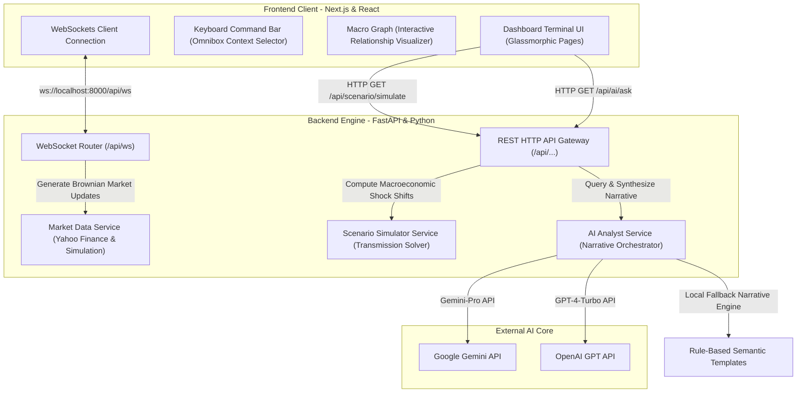

# OpenTerminal (The Hummingbird Project)

> **A High-Density, Cinematic Macro-Economic Intelligence Terminal Blueprint**

OpenTerminal is an open-source architectural blueprint for building a professional, high-performance financial desktop application. Designed to model the core user experience of institutional trading systems (such as Bloomberg or Interactive Brokers TWS), it translates complex global economic shocks into domestic transmission channels affecting the Indian market.

---

## 📖 Table of Contents

- [🧠 Macroeconomic Concepts & Transmission Channels](#-macroeconomic-concepts--transmission-channels)
- [🏗️ System Architecture](#️-system-architecture)
- [✨ Key Features](#-key-features)
- [💻 Technology Stack](#-technology-stack)
- [📂 Project Structure](#-project-structure)
- [🛠️ Installation & Setup](#️-installation--setup)
- [🧪 Running Verification Tests](#-running-verification-tests)
- [🗺️ Future Roadmap](#️-future-roadmap)
- [⚖️ Disclaimer & License](#️-disclaimer--license)

---

## 🧠 Macroeconomic Concepts & Transmission Channels

To understand how global economic events shape domestic markets, we analyze three main transmission pathways. Emerging market economies like India are deeply integrated with global trade and financial systems, making them highly sensitive to global fluctuations.

### 1. The Commodity Price Channel (e.g., Brent Crude Oil)
India imports over 80% of its crude oil. When geopolitical shocks or supply constraints (OPEC+ cuts) drive oil prices up:
* **Trade Deficit & Currency Pressure**: India must buy more dollars to pay for fuel imports, causing capital outflows that depreciate the Rupee ($USD/INR$).
* **Imported Inflation**: Transportation and logistics cost increases diffuse through the economy, raising Consumer Price Index ($CPI$) inflation.
* **Corporate Margin Compression**: Energy-intensive industries (paint, chemical, automotive) face input-cost spikes, reducing corporate net profit margins.

### 2. The Interest Rate Differential Channel (e.g., US Federal Reserve Policy)
When the US Federal Reserve increases interest rates to cool its economy:
* **FII Outflows**: The yield spread between Indian government bonds and US Treasuries narrows. Foreign Institutional Investors (FIIs) pull capital out of emerging markets in search of risk-free US yield.
* **Capital Cost Escalation**: To prevent capital flight and protect the currency, the Reserve Bank of India (RBI) is forced to hold domestic repo rates high. This raises the cost of borrowing for Indian corporations and homebuyers.

### 3. The Safe-Haven Asset Channel (e.g., Gold & Geopolitical Risk)
During periods of high geopolitical risk:
* **Flight to Safety**: Capital flows into gold and USD.
* **Bilateral Asset Impacts**: Rising gold prices increase the value of Indian household gold reserves (boosting private wealth), but also swell the national import bill, contributing to a wider trade deficit.

---

## 🏗️ System Architecture

OpenTerminal utilizes a decoupled client-server architecture. It features a high-performance single-page Next.js dashboard client and an asynchronous FastAPI backend service running live simulations and data dispatchers.



### Flow Breakdown
1. **Real-time Live Feed**: The Next.js frontend establishes a permanent WebSocket connection to `ws://localhost:8000/api/ws`. The backend streams simulated Brownian market ticks and triggers threshold-based alerts (e.g., Crude spikes or Gold surges) every 1.5 seconds.
2. **Scenario Stress-Testing**: When a user adjusts parameters (Brent Crude, US Fed Rate, Geopolitical Risk) in the simulation panel, the frontend calls the REST API. The backend computes the transmission offsets and returns simulated output metrics (CPI Inflation, GDP Growth, Rupee exchange rates).
3. **AI Copilot Assistance**: Queries entered into the Chat Copilot or Command Bar are evaluated by the AI service. If external keys are provided, it query-routes to OpenAI/Gemini; otherwise, it matches keywords locally to output a high-fidelity structured analysis card.

---

## ✨ Key Features

* **Glassmorphic Multi-Dashboard Interface**: Five specialized desktop panels:
  * **Investor**: Tracks real-time commodity tickers, equities indexes, and currency spreads.
  * **Economist**: Hosts the interactive scenario simulator and stress-test suite.
  * **Student**: An interactive educational sandbox breaking down economic jargon.
  * **Research**: Synthesizes formal research papers and expert commentary.
  * **Government**: Aggregates alternative data, tax receipts, and fiscal targets.
* **Scenario Simulator Sandbox**: Models custom economic shocks (e.g., Brent Crude spikes to $120/bbl, US Federal Reserve holding rates at 5.5%, Geopolitical risk escalating) and analyzes the immediate, simulated effects on India's core indicators.
* **Macroeconomic Causality Graph**: An interactive node-link graph mapping variables like interest rates, capital flows, and earnings. It traces and explains the shortest causal pathway between any two nodes.
* **Omnibox Command Bar**: A global command palette activated with `/` or `Ctrl+K`. It allows users to quickly jump between dashboards, run simulations, or trigger the AI Copilot.
* **AI Copilot (Narrative Engine)**: A sidebar analyst responding to natural-language economic questions with tailored summaries, root-cause assessments, opportunities, and risk reports.

---

## 💻 Technology Stack

### Frontend Client
* **Framework**: React 19, Next.js 15 (App Router), TypeScript
* **Styling**: Tailwind CSS
* **Icons**: Lucide React
* **State & Networking**: WebSockets, React Context / State Hooks

### Backend Engine
* **Language/Framework**: Python 3.9+, FastAPI, Uvicorn (ASGI Server)
* **Mathematical Operations**: NumPy, Pandas, SciPy (Brownian motion simulations and regression mapping)
* **Networking**: HTTPX (Asynchronous REST clients for LLM and financial integrations)
* **Libraries**: `yfinance` (real-time market seeds), `pydantic-settings` (environment configuration management)

---

## 📂 Project Structure

```bash
The-Humming-Bird-Project/
├── backend/                             # Python ASGI Backend
│   ├── app/
│   │   ├── core/
│   │   │   └── config.py                # Environment and configuration settings
│   │   ├── routers/                     # HTTP and WebSocket API routers
│   │   │   ├── ai.py                    # AI copilot & causality tracing endpoints
│   │   │   ├── economy.py               # Indian macro indicator endpoints
│   │   │   ├── market.py                # Financial market data endpoints
│   │   │   ├── news.py                  # Macroeconomic news feed endpoints
│   │   │   ├── scenario.py              # Stress-test simulation endpoints
│   │   │   └── ws.py                    # WebSockets broadcasting connection manager
│   │   ├── services/                    # Business logic & simulation engines
│   │   │   ├── ai_analyst.py            # Natural Language Processing & LLM orchestrator
│   │   │   ├── alternative_data.py      # Non-traditional indicator aggregates
│   │   │   ├── economic_data.py         # Baseline domestic statistics database
│   │   │   ├── forecasting.py           # Trend extrapolation models
│   │   │   ├── market_data.py           # Brownian simulation & market tickers service
│   │   │   ├── news_engine.py           # Geopolitical news feed generator
│   │   │   ├── relationship_engine.py   # Macro graph causal tracer & nodes database
│   │   │   └── scenario_simulator.py    # Structural shock simulation resolver
│   │   └── main.py                      # FastAPI App initialization & lifecycle manager
│   └── requirements.txt                 # Backend Python dependencies
│
├── frontend/                            # Next.js SPA Client
│   ├── public/                          # Static assets and graphics
│   ├── src/
│   │   ├── app/                         # App router configuration
│   │   │   ├── globals.css              # Global custom CSS and terminal styles
│   │   │   ├── layout.tsx               # Primary application layout layout
│   │   │   └── page.tsx                 # Main application dashboard layout
│   │   └── components/                  # Reusable UI widgets
│   │       ├── AICopilot/               # AI Analyst panels & relationship graphs
│   │       ├── Dashboards/              # Panel views (Investor, Economist, etc.)
│   │       ├── ScenarioSimulator/       # Stress-test sliders & simulation widgets
│   │       └── CommandBar.tsx           # Omnibox keyboard command launcher
│   └── package.json                     # Frontend Node dependencies
│
├── scripts/
│   └── test_backend.py                  # Integration & API validation tests
└── README.md                            # Documentation Blueprint
```

---

## 🛠️ Installation & Setup

### 1. Prerequisites
* **Python**: `3.9` or higher
* **Node.js**: `18.x` or higher
* **Package Managers**: `npm` (bundled with Node) and `pip` (bundled with Python)

---

### 2. Backend Installation

1. Navigate to the backend directory:
   ```powershell
   cd backend
   ```

2. Create and activate a python virtual environment (recommended):
   ```powershell
   python -m venv venv
   # On Windows:
   .\venv\Scripts\activate
   # On macOS/Linux:
   source venv/bin/activate
   ```

3. Install dependencies:
   ```powershell
   pip install -r requirements.txt
   ```

4. *(Optional)* Configure your LLM API credentials by creating a `.env` file in the root of the `backend/` directory:
   ```env
   GEMINI_API_KEY=your_gemini_key_here
   OPENAI_API_KEY=your_openai_key_here
   ```
   *Note: If no keys are specified, the backend automatically falls back to its highly-detailed local narrative engine.*

5. Launch the FastAPI server:
   ```powershell
   uvicorn app.main:app --reload --port 8000
   ```
   The interactive API docs will be viewable at [http://localhost:8000/docs](http://localhost:8000/docs).

---

### 3. Frontend Installation

1. Open a new terminal session and navigate to the frontend directory:
   ```powershell
   cd frontend
   ```

2. Install the package dependencies:
   ```powershell
   npm install
   ```

3. Start the Next.js local development server:
   ```powershell
   npm run dev
   ```
   The client application will start at [http://localhost:3000](http://localhost:3000).

---

## 🧪 Running Verification Tests

An automated test suite is included to verify the FastAPI routing layer, yfinance seed parsing, and LLM fallback logic.

1. Ensure the backend server is running on `http://127.0.0.1:8000`.
2. Run the test script from the root workspace directory:
   ```powershell
   python scripts/test_backend.py
   ```
   If all endpoints are active and returning mathematically valid structures, you will see a `ALL BACKEND VERIFICATION TESTS PASSED SUCCESSFULLY!` output.

---

## 🗺️ Future Roadmap

- [x] Configure backend WebSockets for real-time tickers.
- [x] Integrate global Command Bar (Omnibox) navigation shortcuts.
- [x] Connect multi-perspective dashboards (Investor, Student, Economist views).
- [ ] Add historical chart visualization using TradingView Lightweight Charts.
- [ ] Implement database persistence (PostgreSQL/TimescaleDB) for historical ticker ticks.
- [ ] Integrate actual brokerage test APIs (e.g., Zerodha Kite Sandbox / Interactive Brokers Paper Trading).

---

## ⚖️ Disclaimer & License

**Disclaimer**: This platform is created purely for educational and architectural research purposes. None of the tools, outputs, or simulations constitute financial, investment, tax, or legal advice. All ticking assets are delayed, simulated, or mocked, and are not suitable for live trading.

Distributed under the **MIT License**. See `LICENSE` for details.
